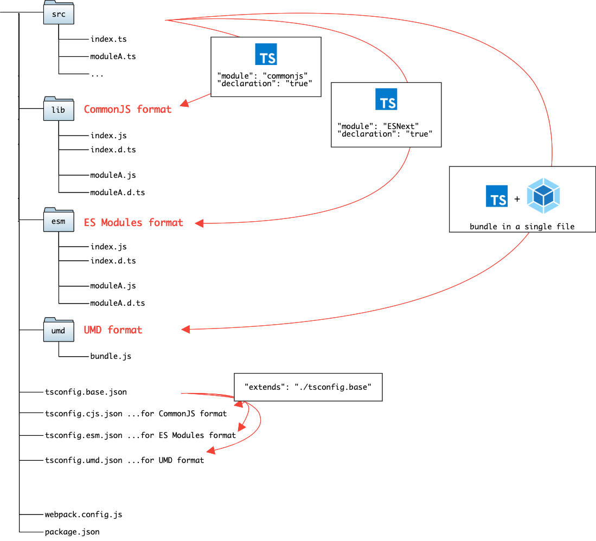

TypeScript npm Package Template
===============================

A template for developing a npm package that supports multiple module formats (CommonJS, ES Modules and UMD).

### File Structure



```zsh
src/ # Source files written in TypeScript
  - moduleA.ts
  - moduleB.ts
  - index.ts
lib/ # CommonJS format (`module.exports/require`) JS files
  - moduleA.js
  - moduleB.js
  - index.js
esm/ # ES Modules format (`import/export`) JS files
  - moduleA.js
  - moduleB.js
  - index.js
umd/ # UMD format, bundled JS file
  - my-typescript-package.js
```

### How to Develop

```zsh
$ npm install
$ npm run build # generates `lib`, `esm`, and `umd`
```
